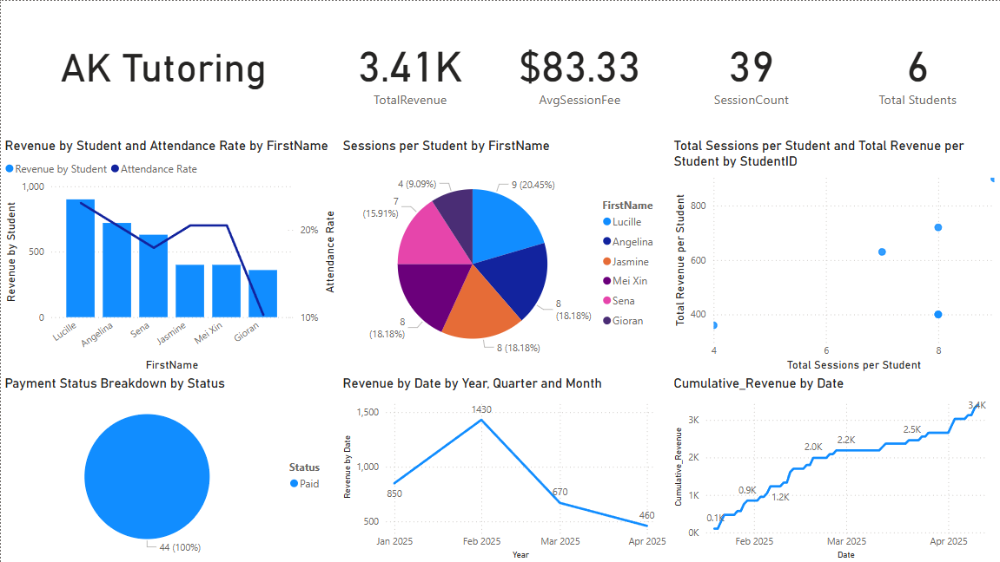

 # 🎓 Tutoring Business SQL Database & Analytics Dashboard

This project contains everything needed to manage and analyze a private tutoring business, including SQL scripts and a Power BI dashboard.

---

## 📁 Project Structure

```
tutoring-sql-project/
│
├── SQL/
│   ├── tables.sql
│   ├── procedures.sql
│   ├── triggers.sql
|   ├── test_data.sql
│   └── views.sql
│
├── PowerBI/
│   └── TutoringDashboard.pbix
|   
│
├── screenshots/
│   └── Dashboard.png
│
└── README.md
```

---

## 📊 Key Features

- Track student details and session history.
- Monitor and analyze payments and revenue.
- Automated status updates for sessions and payments.
- Built-in reporting views for Power BI or other BI tools.

---

## 🛠️ Technologies

- SQL Server (Transact-SQL)
- Azure SQL or Local SQL Server
- Power BI (with DAX Measures)

---

## 🧩 SQL Components

### ✅ Tables (`SQL/tables.sql`)
Defines schema for:
- `Students`
- `Sessions`
- `Session_Students`
- `Payments`

### ⚙️ Stored Procedures (`SQL/procedures.sql`)
- Add students and payments
- Get session history
- Archive Year 12 graduates

### 🔁 Triggers (`SQL/triggers.sql`)
- Auto-update student `LastSessionDate`
- Mark payments as 'Paid' if they match the session fee

### 📄 Views (`SQL/views.sql`)
- `vw_StudentTotal_Payments`: Payment summary per student
- `vw_StudentSessionHistory`: Full session timeline

---

## 📈 Power BI Dashboard

Located in `PowerBI/TutoringDashboard.pbix`.

### Dashboard Features

- 💰 **Total Revenue**
- 📈 **Cumulative Revenue Over Time**
- 🎯 **Student Attendance Rate**
- 👤 **Active Student Count**
- 📍 **Session Distribution**
- 📊 **Finance Insights (Daily/Monthly Trends)**
- 📌 **Scatterplot: Sessions vs Revenue per Student**

📸 **Sample Preview:**



---

## 🚀 Getting Started

1. Run the SQL files inside the `/SQL/` folder (tables, procedures, triggers, views).
3. Connect the Power BI file to your SQL database.
4. Refresh the dashboard and explore the data.

---

## 📌 Example Use Cases

- Track monthly revenue and active students
- Identify top-paying students
- Monitor attendance trends over time
- Forecast cash flow with cumulative revenue charts

---
> For private education analytics & insights.
